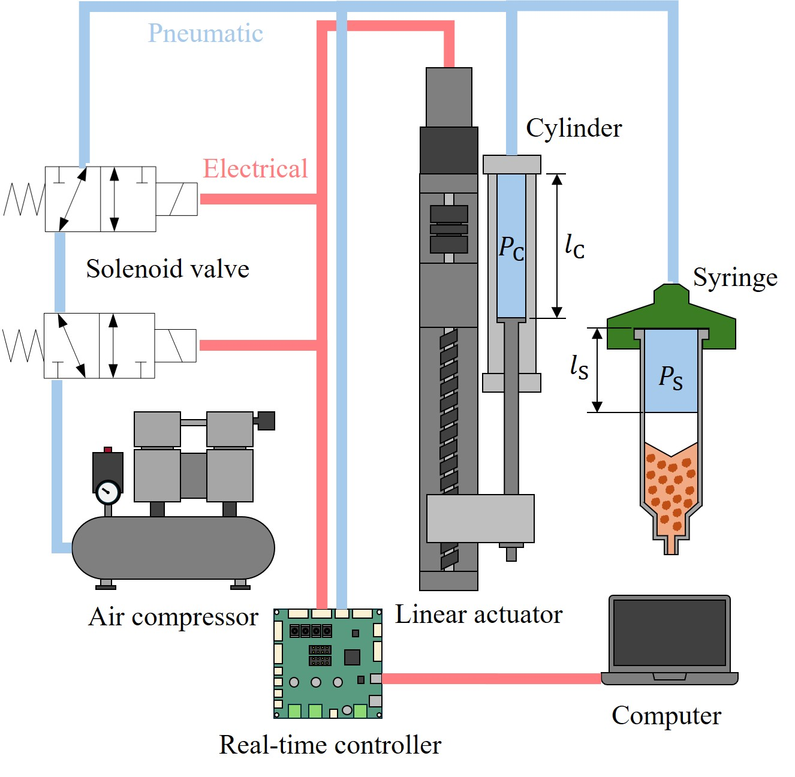

# Flexible-actuated Pneumatic Extusion for Direct Ink Writing

This repository supports the development of a flexible material extrusion architecture for Direct Ink Writing (DIW), featuring switchable actuation between pressure and feedrate control.
The system is specifically designed for printing nonhomogeneous and sensitive materials, such as cell-laden hydrogels and other biomaterials.

The extrusion process is driven by a piston-based pneumatic system, enabling:

* Intrinsic real-time monitoring of extrusion pressure via the enclosed pneumatic connection

* Estimation of extrusion feedrate based on the working air volume, calculated using an air model

This flexible actuation approach ensures consistent linewidth and preserves the viability of cells and other additives for demanding applications in bioprinting and soft material additive manufacturing.

# Experimental data

Results from four key experiments are included:

* [Determination of system's dead volume](https://github.com/schaiwuth/flexible-diw-pneumatic-extrusion/tree/main/dead_volume)

* [Stationary extrusion of gelatin](https://github.com/schaiwuth/flexible-diw-pneumatic-extrusion/tree/main/stationary_extrusion)

* [Line printing of gelatin](https://github.com/schaiwuth/flexible-diw-pneumatic-extrusion/tree/main/line_printing)

* [Detection of material depletion during extrusion of polypropylene](https://github.com/schaiwuth/flexible-diw-pneumatic-extrusion/tree/main/depletion_detection)

All datasets are provided in MAT-file format (.mat), which can be extracted and analyzed using the accompanying Live Script files (.mlx).

# Videos

Demonstration videos showcasing system capabilities:

* [Detection of matarial depletion in high-temperature printing](https://1drv.ms/v/c/533cd4f968f73b8c/EbwAR6mQ-o1LhUJ56t2CcAMB7NIwh4Uj2uuzpHuhPG7QtA?e=JLGdqD)
